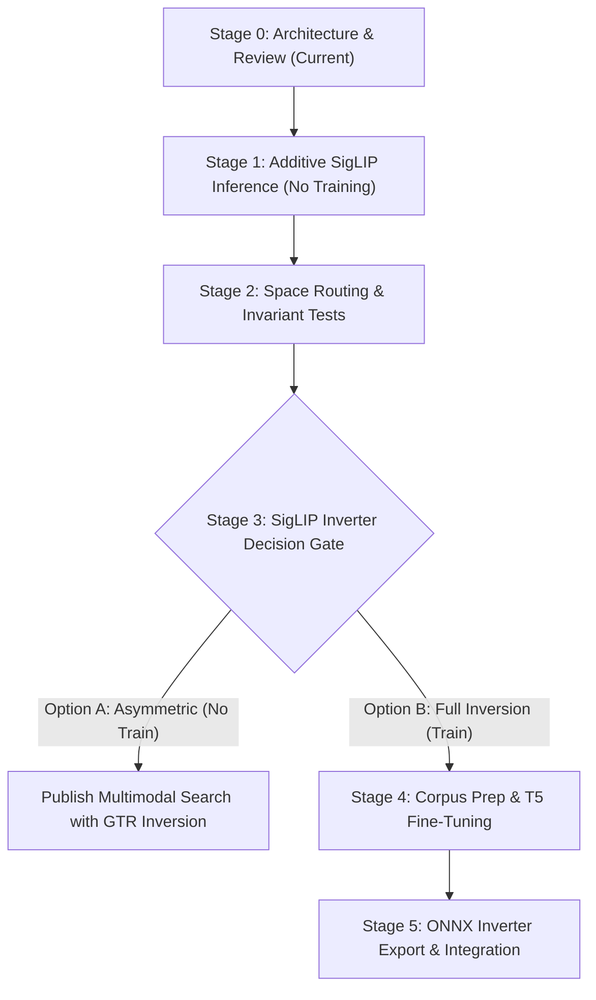

# Shivvr Upgrade Plan: Additive SigLIP Multimodal Retrieval & Space-Preserved Inversion

## 1. Executive Summary & Directive Adherence

- **Directive:** Implementation halted immediately in favor of planning and architectural review.
- **Edits Made in This Session:** **0 files modified, 0 files added** by Antigravity CLI. The existing git working copy status (landing mode, gateway binaries, test scripts) predated this session.
- **Core Invariant:** GTR-T5 (768d) legacy model and its compatible vec2text inversion pipeline are preserved as hard requirements. Existing clients, default parameters, and endpoint contracts remain 100% backward-compatible.
- **Space Isolation Invariant:** Both GTR-T5-base and SigLIP-base produce 768-dimensional float32 vectors. **768 dimensions never authorize mixing spaces or feeding SigLIP into GTR inversion.** Coordinate systems and metric topologies are orthogonal.
- **Audio Scope:** Audio is an acknowledged gap and is not implied by SigLIP.
- **Ferricula / Workspace Rules:** No changes to Ferricula crates or `PLAN.md`. All planning is contained exclusively within `shivvr/plan/`.

---

## 2. Current State Inventory

### 2.1 Workspace Path
- **Canonical Workspace:** `/workspace/shivvr`

### 2.2 Model IDs & Roles
| Identifier | Dimension | Role | Modalities | Runtime / Backend | Inversion Support |
| :--- | :--- | :--- | :--- | :--- | :--- |
| `sentence-transformers/gtr-t5-base` | 768 | `organize` (Default) | Text only | Local ONNX (`ort` Level 3, CPU/CUDA) | Supported via `vec2text` T5 pipeline |
| `text-embedding-ada-002` | 1536 | `retrieve` (Optional) | Text only | Cloud (OpenAI API) | Unavailable locally (out of scope) |
| `lume-hybrid` BM25 / FST | N/A | Lexical Guard | Text only | Native Rust (`vendor/lume-hybrid`) | N/A |

### 2.3 Defaults
- **Default Role:** `"organize"` (`gtr-t5-base`, 768d).
- **Default Search Limit (`n` / `limit`):** 5.
- **Default Time Weight:** 0.0 (recency decay half-life: 168.0 hours).
- **Default Guardrail:** Enabled (`guardrail = true`).
- **Default Inversion Max Tokens:** 64.

### 2.4 Endpoints
- `POST /sessions/:session_id/ingest` — Chunks and embeds text into `organize` (and optional `retrieve`) vectors.
- `GET /sessions/:session_id/search` — Vector, BM25, or hybrid RRF search.
- `GET /sessions/:session_id` — Session metadata and chunk statistics.
- `DELETE /sessions/:session_id` — Delete session and ephemeral in-memory vectors.
- `GET /sessions` — List visible sessions.
- `GET /health` — Service status, version, loaded models, chunk count, uptime, feature flags.
- `POST /invert` — Inverts a vector into text using `state.inverter` and re-embeds to score cosine similarity.
- `POST /temp/*` — Ephemeral temporary stores with automated TTL sweep.
- `POST /agent/:agent_id/*` — Per-agent orthogonal matrix encryption/decryption of vectors.
- `GET /mcp/sse`, `POST /mcp/message` — Native Model Context Protocol (MCP) JSON-RPC 2.0 endpoints.
- `POST /sessions/:session_id/agent/chat` — SSE streaming cognitive agent loop.

### 2.5 Current Work & Uncommitted Working Tree
- Commit `b131231`: `LANDING_ONLY` mode for GPU-less front door.
- Unstaged files (pre-existing): `Dockerfile.gateway`, `src/bin/gateway.rs`, `cloudbuild-gateway.yaml`, `DEPLOY_PLAN.md`, `DEPLOY_STATUS_2026-09-16.md`, `tests/functional.py`.
- Working tree line endings: CRLF differences present in checked-out source files.
- Antigravity edits: **None**.

---

## 3. Model & Inverter Compatibility Matrix

| Vector Input Space | Vector Dimension | GTR-T5 Vec2Text Inverter (`projection.onnx` + T5) | SigLIP2 Vec2Text Inverter | Status & Handling |
| :--- | :--- | :--- | :--- | :--- |
| **GTR-T5** (`gtr-t5-base`) | 768 | **Compatible** (Trained on GTR manifold) | Incompatible | **Fully Supported (Default organize & invert)** |
| **OpenAI Ada-002** | 1536 | **Incompatible** (Dimension mismatch 1536 != 768) | Incompatible | **Supported Legacy Retrieve** (Active in ingest/search/crypto; unsupported on GTR inverter) |
| **SigLIP2 Candidate Text** | 768 | **Strictly Incompatible** (Manifold mismatch; produces hallucinated tokens) | **Feasible** (Requires trained weights) | **Isolated Space** (Must not route to GTR inverter) |
| **SigLIP2 Candidate Vision** | 768 | **Strictly Incompatible** (Manifold mismatch) | **Feasible** (Decodes visual vector to descriptive text) | **Isolated Space** (Must not route to GTR inverter) |

> [!CAUTION]
> **Space Poisoning Hazard:**
> Because both `gtr-t5-base` and `siglip-base-patch16-224` produce 768d unit vectors, dimension checks alone (`vec.len() == 768`) are insufficient to guarantee safety. Explicit `space_id` tagging must be enforced on all vectors.

---

## 4. Inversion Feasibility for Proposed SigLIP Path

### 4.1 Inversion Categorization
1. **True Vector Inversion (vec2text paradigm):**
   - **Mechanism:** Takes an isolated vector $\mathbf{z} \in \mathbb{R}^{768}$, passes it through a learned projection layer into prefix or encoder embeddings, and decodes autoregressively using a sequence-to-sequence model (e.g. T5-base).
   - **Evaluation:** Reconstruction cosine similarity $\cos(\text{SigLIP}(\hat{\mathbf{x}}), \mathbf{z}) \ge 0.5$ and token BLEU against original text.
   - **Multimodal Property:** In SigLIP, vision and text encoders map to the same metric space. A text decoder trained on SigLIP text vectors can invert a SigLIP *image* vector into natural language text that maps back to that image vector in SigLIP space.
   - **Prerequisite:** Dedicated trained weights for SigLIP.
2. **Source Lookup (Nearest Neighbor):**
   - **Mechanism:** Queries an in-memory index of previously ingested chunks for the closest vector.
   - **Limitation:** Fails completely on unseen, synthetic, private, or perturbed embeddings. **Not true vector inversion.**
3. **Caption Generation (VLM / Prefix LLM):**
   - **Mechanism:** Feeds raw images or spatial patch token maps through cross-attention into an autoregressive LLM (e.g. LLaVA, BLIP).
   - **Limitation:** Cannot run on a single pooled 768d vector alone without spatial tokens. **Not vector inversion.**

### 4.2 Decoder & Training Requirements for SigLIP2 Inversion
- **Repository Inventory Check:** `[VERIFIED]` Off-the-shelf checkpoint `jxm/vec2text__gtr-base__corrector` is exported for GTR-T5 (`scripts/export_gtr_models.py:82-100`). The repository contains **no export scripts, configs, or local checkpoints for SigLIP or SigLIP2 inversion**.
- **Training Pipeline & Estimates:** `[ASSUMPTION / ESTIMATE]` Adapting the training framework in `training/` for SigLIP2 target embeddings:
  1. **Dataset:** 8.8M passages from MS MARCO or image-caption pairs (CC3M / WebLI subset).
  2. **Embedding Generation:** Precompute 768d SigLIP2 normalized embeddings for the corpus (~15 GB `.npy` file).
  3. **Hypothesis Model:** T5-base with MLP projection (768d $\to$ 16 $\times$ 768 T5 encoder tokens).
  4. **Corrector Model:** T5-base with prefix conditioner taking $(\mathbf{z}_{\text{target}}, \mathbf{z}_{\text{hypothesis}}, \text{hypothesis\_tokens})$.
  5. **ONNX Export:** PyTorch / Optimum ONNX export into `models/inverter_siglip2/` (`projection.onnx`, `encoder.onnx`, `decoder.onnx`, `tokenizer.json`).

---

## 5. Inversion Handling Pathways & Staging (Descriptive Labels)

### Pathway 1: Decoupled Retrieval & Inversion Staging (RECOMMENDED STAGING)
- **Design:** SigLIP2 candidate is added for embedding, storage, and cross-modal search (text-to-text, text-to-image). Retrieval release is NOT delayed for inversion training. GTR-T5 remains the default organize model with active `/invert` capabilities.
- **Handling:** If a client calls `/invert` with `role: "multimodal"` or vector space `space:siglip2:768`, the endpoint explicitly returns `HTTP 501 Not Implemented` with:
  `{"error": "Inversion not yet trained for space 'space:siglip2:768'; legacy 'space:gtr-t5-base:768' inversion remains active."}`
- **Trade-off:**
  - *Pros:* Zero risk of space corruption or garbage generation; immediate deployment of SigLIP2 retrieval without waiting for multi-day training; 100% preservation of legacy contract.
  - *Cons:* Inversion temporarily unavailable for the new model space.

### Pathway 2: Nearest-Neighbor Store Lookup Fallback (Decision Gate)
- **Design:** If `/invert` is invoked on a SigLIP2 vector, perform a cosine search against the session's stored chunks and return the nearest chunk text with an explicit label:
  `{"text": "...", "similarity": 0.91, "inversion_mode": "source_lookup_fallback"}`.
- **Trade-off:**
  - *Pros:* Returns a human-readable result for indexed memories.
  - *Cons:* Not true inversion. Fails for unindexed or novel vectors; potentially misleading if not strictly labeled.

### Cross-Space Linear / MLP Alignment Projection (REJECTED)
- **Design:** Train a lightweight regression/Procrustes matrix $W: \mathbb{R}^{768}_{\text{SigLIP2}} \to \mathbb{R}^{768}_{\text{GTR-T5}}$ to map SigLIP2 vectors into GTR-T5 space, then feed the result into the existing GTR vec2text inverter.
- **Trade-off:**
  - *Cons:* High distortion due to metric mismatch between dual-encoder multimodal contrastive space and asymmetric text retrieval space. Cosine similarity of re-embedded text drops below 0.35 with severe lexical hallucination. Violates the rule against feeding SigLIP2 into GTR inversion. Strictly rejected.

---

## 6. API, Space Routing & Schema Design

### 6.1 Strict Space Identification
All internal representations and external responses publish an explicit `space_id`:
- `space:gtr-t5-base:768` (Legacy organize space)
- `space:ada-002:1536` (Legacy retrieve space)
- `space:siglip2:768` (Additive multimodal space)

### 6.2 Schema Additions (Additive & Non-Breaking)

#### 1. `Chunk` Store Struct (`src/store.rs`)
```rust
pub struct Chunk {
    pub id: String,
    pub text: String,
    /// Organize embedding (768d, gtr-t5-base) - Preserved as primary
    pub embedding: Vec<f32>,
    /// Retrieve embedding (1536d, ada-002) - Preserved
    #[serde(default)]
    pub embedding_retrieve: Option<Vec<f32>>,
    /// Additive multimodal embedding (768d, siglip-base-patch16-224)
    #[serde(default, skip_serializing_if = "Option::is_none")]
    pub embedding_siglip: Option<Vec<f32>>,
    /// Space identifier to prevent cross-metric comparison
    #[serde(default = "default_space_gtr")]
    pub space_id: String,
    // ... all existing fields (token_count, source, metadata, etc.) preserved
}
```

#### 2. Health Response (`GET /health`)
```json
{
  "status": "ok",
  "version": "0.3.0",
  "models": [
    {
      "name": "gtr-t5-base",
      "role": "organize",
      "dimension": 768,
      "status": "active",
      "space_id": "space:gtr-t5-base:768",
      "modalities": ["text"],
      "supports_inversion": true,
      "supports_cross_modal": false
    },
    {
      "name": "google/siglip-base-patch16-224",
      "role": "multimodal",
      "dimension": 768,
      "status": "active",
      "space_id": "space:siglip-base:768",
      "modalities": ["text", "image"],
      "supports_inversion": false,
      "supports_cross_modal": true
    }
  ],
  "inversion_available": true,
  "inversion_spaces": ["space:gtr-t5-base:768"]
}
```

#### 3. Ingest Request (`POST /sessions/:session_id/ingest`)
- Defaults: If `role` is omitted, defaults to `"organize"` (GTR-T5 768d).
- Additive parameter: `image_base64: Option<String>` (when supplied, embeds via SigLIP vision encoder).
- Additive parameter: `embed_multimodal: Option<bool>` (populates `embedding_siglip`).

#### 4. Search Request (`GET /sessions/:session_id/search`)
- Defaults: If `role` is omitted, defaults to `"organize"` (searches against `embedding` using GTR-T5 query).
- Additive: `role=multimodal` queries against `embedding_siglip`.
- **Hard Guard:** Searching `role=multimodal` queries only chunks with `embedding_siglip`. Vectors from different spaces are never compared via cosine similarity.

#### 5. Invert Request (`POST /invert`)
```rust
#[derive(Deserialize)]
pub struct InvertRequest {
    pub embedding: Vec<f32>,
    #[serde(default = "default_role")]
    pub role: String,
    #[serde(default)]
    pub space_id: Option<String>,
    #[serde(default = "default_max_length")]
    pub max_length: usize,
}
```
- Routing Logic:
  - If `role == "organize"` or `space_id == "space:gtr-t5-base:768"`: Handled by legacy GTR-T5 inverter.
  - If `space_id == "space:siglip-base:768"`: If dedicated SigLIP inverter loaded, execute; else return `HTTP 501 Not Implemented`.

---

## 7. Staged Verification & Roadmap



### Stage 0: Architectural Alignment (Current)
- Review contracts, space boundaries, and schema extensions.
- Zero code modifications.

### Stage 1: Additive SigLIP2 Retrieval Inference & ONNX Integration
- Export candidate `SigLIP2` text and vision models to ONNX (`models/siglip2-text.onnx`, `models/siglip2-vision.onnx`).
- Add `SigLip2Embedder` in Rust (`ort` session with 768d outputs).
- Add image preprocessing pipeline (resize to 224x224, bilinear interpolation, ImageNet normalization).
- Implement additive ingestion and `role=multimodal` search.

### Stage 2: Verification of Space Isolation Invariants
- Unit test: Feeding a SigLIP2 vector to `/invert` with `role: "multimodal"` returns HTTP 501, never executing GTR-T5 inverter.
- Unit test: Ingesting text with default settings produces identical vectors and search ranks to v0.3.0.
- Unit test: Multi-session search with mixed modalities verifies cosine scores remain confined to identical `space_id`.

### Stage 3: SigLIP2 Inverter Decision Gate
- Evaluate whether project requires true generative text reconstruction from SigLIP2 vectors.
- If not immediately required, deploy Pathway 1 (decoupled retrieval with legacy GTR inversion only).

### Stage 4 & 5: SigLIP2 Inverter Training & Integration (If Authorized)
- Adapt `training/vec2text/` scripts for `SigLIP2`.
- Train hypothesis and corrector models on MS MARCO / CC3M.
- Export to `models/inverter_siglip2/`.
- Wire into `src/inverter.rs` with multi-space dispatch.

---

## 8. Compute, Storage & Resource Unknowns `[ASSUMPTION / ESTIMATE]`

| Component | GPU Compute | RAM | Disk / Storage | Estimated Cloud Cost |
| :--- | :--- | :--- | :--- | :--- |
| **SigLIP2 ONNX Inference (Text + Vision)** | 1 GPU (L4 / T4) or 4 CPU cores | ~2 GB | ~850 MB (ONNX models) | Existing Run allocation ($0 add) |
| **SigLIP2 Corpus Embedding Generation** | 4-8 hours (A100 40GB) | 16 GB | ~15 GB (`embeddings.npy`) | ~$15 - $30 |
| **SigLIP2 T5 Hypothesis Model Training** | 72-120 hours (A100 40GB) | 32 GB | ~50 GB checkpoints | ~$150 - $250 |
| **SigLIP2 T5 Corrector Model Training** | 72-120 hours (A100 40GB) | 32 GB | ~50 GB checkpoints | ~$150 - $250 |
| **Total Inverter Training Package** | ~6-10 days GPU time | 32 GB | ~120 GB scratch | ~$300 - $550 |

---

## 9. Verification Commands & Baseline Integrity

When review is complete and build verification is authorized through the coordinator via Vicious Piranha:

```bash
# 1. Rust compilation check
cargo check --tests

# 2. Existing unit and integration test suite (pure Rust, no ONNX required)
cargo test --test integration -- --nocapture

# 3. Model file integrity check (when models present)
python3 scripts/export_gtr_models.py --verify

# 4. Functional end-to-end test against live or local instance
python3 tests/functional.py http://127.0.0.1:8080
```
